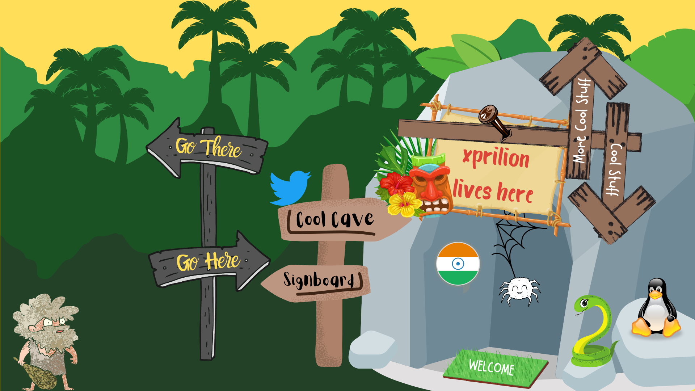

### Hi there 👋

<map name="image-map">
    <area target="_blank" alt="Me" title="Me" href="https://xprilion.com" coords="33,809,223,1077" shape="rect">
    <area target="_blank" alt="Cool Places to Go #1" title="Cool Places to Go #1" href="https://www.packtpub.com/data/mobile-deep-learning-projects" coords="391,410,489,322,498,359,744,381,722,487,503,451,498,498" shape="poly">
    <area target="_self" alt="Just, here" title="Just, here" href="https://github.com/xprilion" coords="411,692,649,678,661,643,754,722,659,802,649,760,437,799" shape="poly">
    <area target="_blank" alt="Tweet, Tweet" title="Tweet, Tweet" href="https://twitter.com/xprilion" coords="794,507,67" shape="circle">
    <area target="_self" alt="Hop in!" title="Hop in!" href="https://github.com/xprilion?tab=repositories" coords="766,583,1034,543,1137,609,1035,666,779,668" shape="poly">
    <area target="_self" alt="Just hop in!" title="Just hop in!" href="https://github.com/xprilion?tab=repositories" coords="1278,961,1522,994,1460,1070,1220,1038" shape="poly">
    <area target="_blank" alt="Cool Places to Go #2" title="Cool Places to Go #2" href="https://www.packtpub.com/data/hands-on-python-deep-learning-for-web" coords="712,782,795,731,1010,731,1022,810,796,843" shape="poly">
    <area target="_blank" alt="My Country" title="My Country" href="https://en.wikipedia.org/wiki/India" coords="1266,727,62" shape="circle">
    <area target="_self" alt="Web Development" title="Web Development" href="https://github.com/xprilion?tab=repositories&amp;q=&amp;type=&amp;language=javascript" coords="1434,795,65" shape="circle">
    <area target="_self" alt="Python Wrangling" title="Python Wrangling" href="https://github.com/xprilion?tab=repositories&amp;q=&amp;type=&amp;language=python" coords="1578,812,1705,1020" shape="rect">
    <area target="_blank" alt="Leaving? Go here!" title="Leaving? Go here!" href="https://xprilion.com/blog/" coords="1580,220,1532,268,1488,224,1616,98,1731,234,1690,273,1646,231,1627,493,1563,490" shape="poly">
    <area target="_self" alt="Hopping in now!" title="Hopping in now!" href="https://github.com/xprilion?tab=repositories" coords="1680,283,1739,287,1726,554,1773,521,1812,559,1733,631,1682,676,1566,548,1612,507,1663,553" shape="poly">
    <area target="_blank" alt="My <3 OS" title="My <3 OS" href="https://elementary.io/" coords="1792,764,1839,764,1892,932,1731,931" shape="poly">
</map>

Here are some ideas to get you started:

- 🔭 I’m currently working on ...
- 🌱 I’m currently learning ...
- 👯 I’m looking to collaborate on ...
- 🤔 I’m looking for help with ...
- 💬 Ask me about ...
- 📫 How to reach me: ...
- 😄 Pronouns: ...
- ⚡ Fun fact: ...
-->
